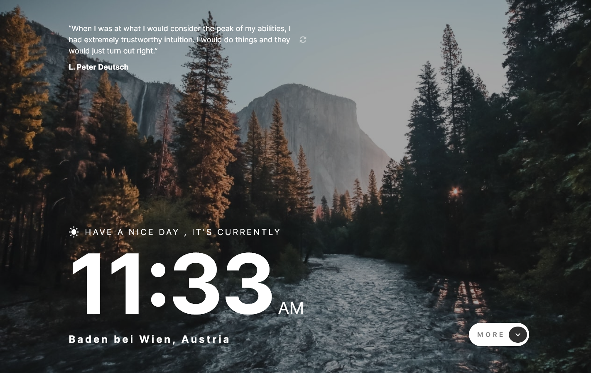
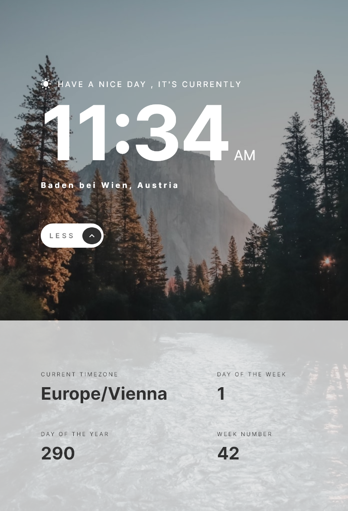
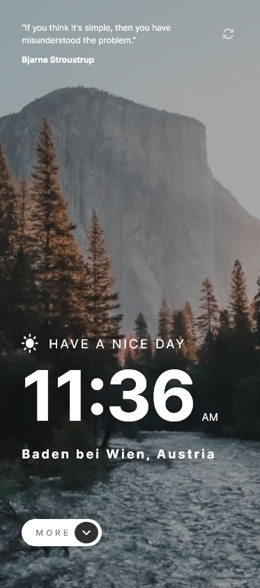

#  Clock App 

## For live preview click  <strong>[here](https://clock-portfolio-project.netlify.app/)</strong> 

## Desktop design overview Home 1440px 

## Tablet design overview  Home 760px 

## Mobile design overview  Home 375px

## Development setup
1. Clone the repo
2. npm install
3. npm run start

##  About Clock App
> This project is a front mentor challenge ( [Front Mentor link ](https://www.frontendmentor.io/home))

## Build With

1. SASS
1. TYPESCRIPT
1. REACT.JS

## Backend APIS
 Geolocation  Api link: <strong>[here](https://geolocation-db.com/json/)</strong> 
 Quotes  Api link: <strong>[here](https://programming-quotes-api.herokuapp.com/index.html)</strong> 

